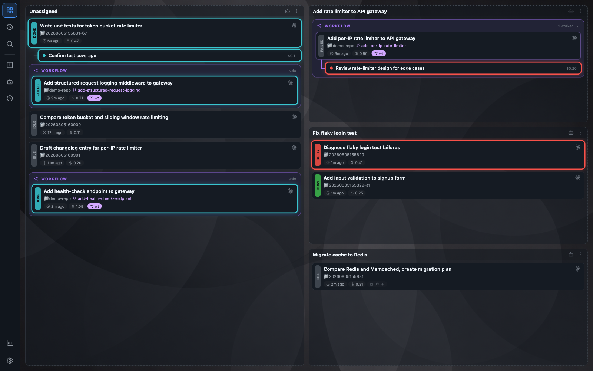
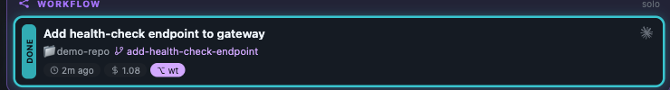
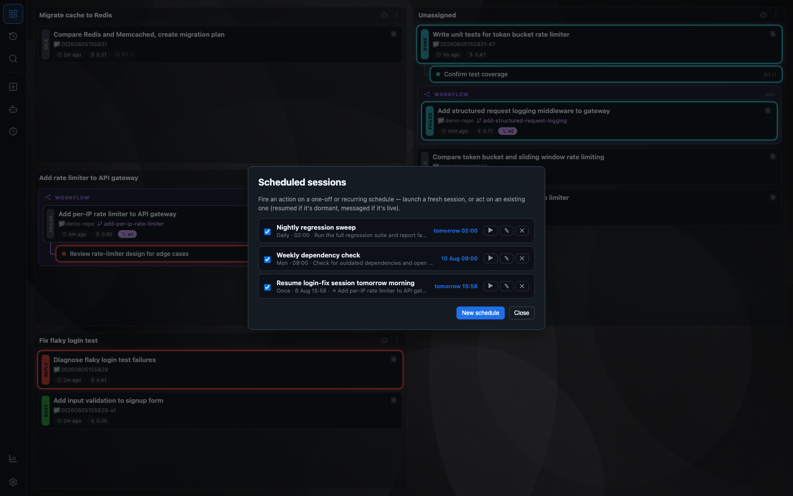
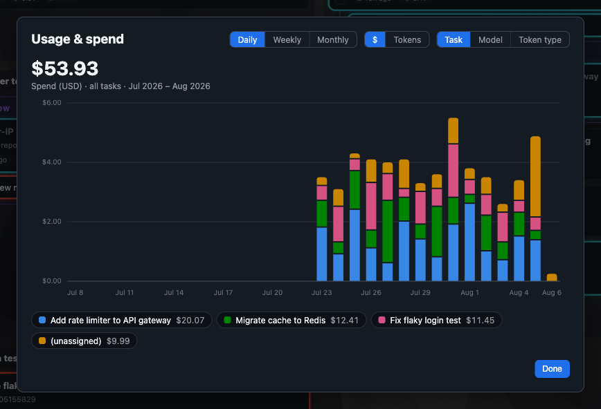
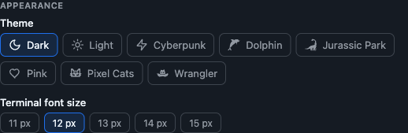

# Agent Wrangler

Agent Wrangler is the command center and control plane for every Claude Code and OpenAI Codex
session you run — one board to dispatch, monitor, and step straight into any session's live terminal.
It's also the channel agents use to coordinate with each other: spawning other agents and whole
multi-agent workflows, handing off work, and messaging one another directly — so a fleet of agents can
get on with it without you relaying every message by hand. It runs entirely on your own machine, under
your control. Codex is offered as an agent automatically when the `codex` binary is on your `PATH`;
otherwise it behaves exactly as a Claude-only board.

## Highlights

- **One board for every session** — dispatch, monitor, and jump into any Claude Code or Codex
  session's live terminal from a single screen, whether you launched it here or elsewhere.
- **A control plane for agents, not just for you** — sessions can spawn other agents and orchestrate
  whole multi-agent workflows, hand tasks off to each other, and send one another messages directly —
  real agent-to-agent coordination, not a one-way dashboard.
- **Visualize your whole fleet, your way** — every agent and its sub-agents rendered on the board,
  grouped under the tasks you assign them to, nested under parent sessions, or collapsed into workflow
  boxes — organize it however makes sense to you.
- **Cost and status at a glance** — per-session and sub-agent spend, live status colours, and a
  needs-you flag the moment a session is blocked on you.
- **A checklist you and the agent share** — each session gets a short checklist beside its terminal.
  You add, edit, tick, reorder and delete items from the board; the session writes to the same list
  through its own tools, so a glance tells you what it is working through without reading the pane.
  It starts collapsed to a small progress chip in the session's header — `2/5` — costing the
  terminal no height until you open it, and each session remembers whether you left it open. It is
  deliberately separate from the agent's own private planning tool — that stays internal scratch
  work and is never mirrored here. Turn the whole thing off in Settings if you'd rather not have it.
- **Hands-off workflows** — hand a session a Jira key, GitHub issue, or free-text task and let it
  run an issue → PR autopilot with no gates, in its own git worktree.
- **Scheduling** — one-off or recurring sessions and nudges — agents can even schedule their own
  wake-ups — evaluated in your timezone, safe across restarts.
- **Idle suspend** — reclaims RAM from idle sessions automatically; resume any dormant card with
  one click, conversation intact.
- **Chat and Terminal views** — chat reads dormant and exited sessions via transcript, while
  terminal attaches only to live panes. Chat shows a recent window of roughly the last 200
  events — enough that a typical session is visible whole — but history older than that window
  is not reachable from the UI. It surfaces Claude Code's end-of-turn recap, and offers the
  recap's proposed next step as a one-click prompt (loaded into the composer, never sent for
  you). Permission prompts only exist in the pane, so chat offers a one-click hop to the
  terminal to answer one and brings you back by itself once it is answered — switching view by
  hand while you are there cancels the return. Esc (or Stop) interrupts a running turn and hands
  the prompt back for editing, as it does in the pane; a draft you have already started is never
  overwritten. The session's current model shows beside the composer, read from the
  pane so it is right the moment it changes, and on an idle Claude session you can click it to
  switch mid-conversation. That runs `/model`, which also saves the choice as your default for
  new Claude sessions — the menu says so. Its font size is its own setting, separate from the terminal's.
  Claude Code's suggested next prompt is offered above the composer too — that one is read off
  the pane, since it exists nowhere else, so it shows only for live Claude sessions and stays
  hidden whenever it can't be told apart from something you were typing.
  Because the transcript records whole messages rather than a token stream, chat cannot show a
  reply arriving word by word the way the terminal does; while a turn is running it shows a
  live row naming the tool in flight and how long the session has been busy.
- **Themeable** — built-in dark/light plus drop-in custom styles.



## Requirements

- macOS or Linux, Node.js >= 20
- `tmux` (sessions launched through the app run inside named tmux sessions) — `brew install tmux`
  on macOS, `apt-get install tmux` (or your distro's equivalent) on Linux
- `gh` (optional — PR auto-attach, check-watching, and auto-merge shell out to it; run
  `gh auth login` once so it's authenticated)

**Windows** isn't supported natively, but works via WSL2 — WSL2 runs a real Linux kernel, so the
Linux path above applies unmodified once you're inside it. Keep your checkout on the WSL2 side of
the filesystem (e.g. `~/...` under Linux), **not** under `/mnt/c/...`: the 9p filesystem bridge to
the Windows side is slow, and inotify doesn't fire for file writes made from the Windows side —
which silently breaks the wrangler's live-status and memory file watchers.

## Run

```bash
npm install
npm start          # serves http://localhost:7878 and opens your browser
```

`npm start` auto-installs after a pull that changes dependencies, so you never
need to remember `npm install`. That's the fastest way to try it out, but for everyday use we'd
recommend running it as a background service instead (below) so it survives restarts and reboots.

Environment variables:

- `AW_PORT` (or legacy `PORT`) — port to listen on (default `7878`)
- `AW_DATA_DIR` — state directory (default `~/.agent-wrangler`); set it with a distinct `AW_PORT` to run an isolated instance
- `AW_OPEN_BROWSER=1` — auto-open the board in a browser on startup (default: off; the legacy `AW_NO_OPEN=1` still suppresses)
- `AW_DEFAULT_MODEL` — model pre-selected in the dispatch dialog, by value (e.g. `fable`, `opus`, `opusplan`, `sonnet`, `sonnet[1m]`, `haiku`); unset or unrecognised leaves the built-in default (`opus`)
- `AW_JIRA_BASE_URL` — Jira browse URL prefix a bare issue key is appended to (e.g. `https://yourcompany.atlassian.net/browse/`); unset by default, so a bare key renders as plain text until this or the per-install `jiraBaseUrl` config value is set
- `AW_DEVCONTAINER_HOST_ADDR` — host address a devcontainer session uses to reach the wrangler's
  own server; defaults to `host.docker.internal`, which Docker Desktop (macOS/Windows) resolves
  automatically but native Docker Engine on Linux does not. On Linux, either run the Docker daemon
  with `--add-host=host.docker.internal:host-gateway` so the default still resolves, or set this
  to a host address the container can reach (e.g. the `docker0` bridge IP). Either way, this alone
  isn't enough on Linux: the server also binds loopback-only by default, so pair it with
  `AW_BIND_HOST=0.0.0.0` (below) or the container still can't reach `/mcp` even once it's dialing
  the right address
- `AW_BIND_HOST` — interface the server listens on (default `127.0.0.1`, loopback-only); set to
  `0.0.0.0` when a devcontainer session needs to reach this server's `/mcp` from inside its
  container. Widens exposure on a shared machine (the control/MCP posture is localhost-advisory),
  so treat it as a deliberate opt-in, not a default

### Run as a background service

To keep it always-on, run it under launchd (macOS) or a systemd user unit (Linux).

**Recommended:** in Claude Code, just ask for the `setup-wrangler-service` skill (e.g. "set up the
wrangler as a service"). It fills in the plist/unit template, loads it via launchctl/systemctl, and
verifies the server is actually serving before reporting success — no manual steps, on either platform.

To do it by hand instead on macOS, copy
`scripts/net.portswigger.agent-wrangler.plist.example` to
`~/Library/LaunchAgents/net.portswigger.agent-wrangler.plist`, fill in the path and username
placeholders, then load it:

```bash
launchctl bootstrap gui/$(id -u) ~/Library/LaunchAgents/net.portswigger.agent-wrangler.plist
```

Restart it after changes with:

```bash
launchctl kickstart -k gui/$(id -u)/net.portswigger.agent-wrangler
```

On Linux, copy `scripts/agent-wrangler.service.example` to
`~/.config/systemd/user/agent-wrangler.service`, fill in the path placeholder, then load it:

```bash
systemctl --user daemon-reload
systemctl --user enable --now agent-wrangler.service
```

Both paths invoke `scripts/wrangler-start.sh`, which resolves Node via nvm, pins a UTF-8 locale so
tmux renders Unicode correctly, and auto-installs after a dependency change.

## Snags

**Sessions can't `ls`/`cp` files in Downloads, Documents, Desktop, etc. (macOS only).** This is
macOS's file-access sandboxing (TCC) — it doesn't apply on Linux. It targets the `tmux` binary, not
your terminal app — because the wrangler's tmux
server daemonizes and reparents under `launchd`, so there's no Terminal.app/iTerm2 in its process
ancestry to grant instead. **Full Disk Access is the only fix that actually works here** — the narrower
"Files and Folders" permission can't be manually populated; it only lists apps macOS has already shown
a real consent prompt to (that's how Terminal.app gets Desktop/Downloads access the first time you `cd`
there), and a headless daemon with no window/Dock presence can't display that prompt, so it never gets
an entry there. Fix: System Settings → Privacy & Security → **Full Disk Access** → **+** → Cmd+Shift+G in
the file picker → paste the resolved path (`readlink -f "$(which tmux)"`, since Homebrew's `tmux` is a
version-pinned symlink into `Cellar/` that moves on every `brew upgrade tmux`, so re-add the grant after
an upgrade) → enable it.

Know what this actually grants: Full Disk Access also covers Mail, Messages, Safari data, Time Machine
backups, and other apps' containers — well beyond Downloads — and it applies to *every* session the
wrangler ever runs (one shared tmux server, not per-session), present and future, since anything running
in any pane inherits it. It doesn't grant new capability over what your own logged-in account can
already do via Finder — TCC is a consent gate on top of normal Unix permissions, not a privilege
boundary — but it does remove that consent step for any command run inside a wrangler session, including
autonomous/unattended agent runs. Grant it deliberately, not as a reflex.

The grant only applies to *new* processes, so the tmux server needs restarting (`tmux -L <socket>
kill-server`, or just kill the process) — this kills every live session on that socket; mapping entries
survive and each card just needs a manual Resume.

## How it works

- **State** is read live from `~/.claude`: `daemon/roster.json` and `sessions/*.json` (watched for
  instant updates), enriched with per-session cost and sub-agents parsed incrementally from the
  transcript under `~/.claude/projects/`.
- **Dispatch** ("+ New session") starts `claude` inside a detached tmux session named `cc_<short>`.
  The app records the `sessionId ↔ tmux` mapping in `~/.agent-wrangler/mappings.json`.
- **Jump in** attaches that tmux session in-browser via xterm.js over a WebSocket (`node-pty`
  running `tmux attach`).
- **Sessions not launched through the app** appear as read-only "external" entries — visible with
  status and cost, but without an attachable terminal until relaunched through the dashboard.

## Workflows (issue → PR autopilot)

Tick **Workflow (issue → PR autopilot)** in the dispatch dialog to launch a hands-off
run: give it an issue — a Jira key (`ENT-1234`), a GitHub issue (URL or `#N`), or a
free-text task — and one Claude session takes it all the way to an open pull request
with no human gates. It always runs in a fresh git worktree, so you can fire a whole
fleet in parallel.

The procedure lives in an in-repo skill, **`issue-to-pr`** (`skills/issue-to-pr/`; the
wrangler just adds the launch toggle, a phase chip, and the `workflow_phase` tracking
tool). The card shows the live phase — `plan → build → verify → PR → done` (labels are
capped at 6 chars to fit the chip) — and reuses the normal terminal states: the auto-attached PR + green CI dot
means *ready to review*; a genuine block flips the card to **needs-you** (red) with a
`failed` chip, where it stops and asks you a question.



**No setup needed:** the wrangler loads the skill via `--plugin-dir` on every Workflow
launch, resolving it from its own install — so it works from any worktree and against
any target repo without a `~/.claude/skills` symlink.

## Scheduled sessions

The **clock button** on the nav rail opens the **Schedules** panel, where you can have
the board run an action automatically — once at a chosen time, or on a recurring
cadence. A schedule is **a saved action + a "when"**, and the action is one of two:



- **New session** — dispatch a brand-new session. Carries the same payload as the
  New-session dialog (folder, prompt/issue, model, task, worktree, and the **Workflow**
  autopilot toggle), so each fire is a normal local board session you can attach to, see
  needs-you/ready on, and assign to a task — not a throwaway cloud run.
- **Existing session** — act on a session already on the board, with an optional
  message. The board decides what that means when it fires: if the session is **dormant**
  it's **resumed** (delivering the message as its first prompt — e.g. "every weekday
  09:00, resume my review session and tell it to check overnight CI"); if it's **live**
  the message is **injected into its terminal** (a recurring nudge). With no message, a
  dormant session is just woken and a live one is left alone.

- **New / Edit** reuses the dispatch dialog with an added **When** section and an
  **action selector**: pick **One-off** (a single date & time), **Daily** (a time), or
  **Weekly on…** (a time + a set of weekdays). Recurring cadences compile to a cron
  expression evaluated in your timezone; a one-off stores an absolute instant.
- Each row shows its cadence, what it does, and its next fire; toggle it on/off, **Run
  now**, edit, or delete in place. The panel updates live.
- **Catch-up is safe across restarts:** a recurring slot missed while the server was
  down fires **once** on the next check (never a backlog), and a one-off more than 12 h
  overdue is marked *missed* rather than fired.
- A recurring schedule that wants a worktree always uses a fresh auto-named one (so
  repeated fires never collide on the same branch).

Agents can create schedules too, via the **`schedule_session` MCP tool** — including
scheduling their own wake-up ("resume me at 3pm to check the deploy"): an existing-session
action's target defaults to the calling session.

Scheduling adds a dependency (`cron-parser`); a running background service needs a
**restart** to pick it up (the startup dependency sync handles the install).

## Idle suspend & resume

A live `claude` session holds ~0.5–0.8 GB of RAM even when idle. To reclaim it, the
board **suspends** idle sessions: it tears down their tmux but keeps them on the
board as dormant, one-click-resumable cards (clicking a dormant card resumes it in
place and re-attaches — the conversation is restored from the transcript).

- **Automatic:** a session idle for **8 hours** is suspended. Tune or disable this in
  `~/.agent-wrangler/config.json` with `"suspendIdleHours": <n>` (`0` disables the
  timer entirely). The value is re-read live — no restart needed.
- **Manual:** right-click a session → **Suspend**, or **snooze** it for ≥ 1 hour
  (a snooze that long also frees its RAM; a shorter snooze just hides it).
- **Never auto-suspended:** a session that is working, awaiting you, has a terminal attached, or
  is running a foreground command.
- **Caveat:** a *detached background* process (e.g. a `run_in_background` dev server)
  under an otherwise-idle session is killed when the timer fires. If you rely on one,
  set `suspendIdleHours: 0`, keep a terminal attached, or don't leave it idle that
  long. (Foreground commands are safe — they read as working.)

After a reboot every session is dormant; nothing is bulk-resumed — bring back the
ones you want with a single click.

## Status colours

- red — needs you (e.g. a permission prompt)
- green — working
- grey — idle / unknown

## Cost tracking

Every card shows its running cost as a live dollar figure — including everything its sub-agents have
spent — so a fleet with a lot going on is never a mystery about what it's costing you. Costs are
computed from the actual transcript, not a rough estimate; the one exception is Codex, which only
reports a cumulative total rather than itemized turns, so its cost is shown with a `~` prefix. Cost
history for a session also outlives Claude Code's own transcript retention, so nothing is lost to
cleanup.

The **Usage & spend** button on the nav rail opens a longer view than the board's per-card figures —
daily/weekly/monthly spend, sliced by task, model, or token type.



For a view outside the app too — spend by month, by task, or by model — see `scripts/cost-report.mjs`,
which recomputes directly from on-disk transcripts.

## Layout

Two views, toggled from the nav rail: **Tasks** (the default board — sessions grouped under the tasks
you assign them to, plus an Ad-hoc lane) and **Search** — the single find-anything surface. Search
browses recent and off-board conversations, runs full-text and metadata queries across every
transcript, and lists archived sessions with resume/fork/delete/restore, so an on-disk session can be
brought (back) onto the board from the same place you found it.

## Themes

The **settings button** (the gear icon on the nav rail) opens **Settings**, whose **Appearance**
section switches between built-in **dark** and **light** and any drop-in custom styles. A custom style
is a folder under `styles/<id>/` with a `theme.json` manifest — a name,
an icon, a `dark`/`light` base, and CSS-variable overrides — plus optional assets like a wallpaper for
translucent themes. The server compiles each manifest to CSS-var overrides and serves it through a
manifest-gated asset route (raw files are never exposed). See `styles/jurassic-park/` for a worked
example. All UI colours — including the xterm terminal — flow through these variables, so both
built-in and custom styles re-theme the whole app live.



## License

Apache License 2.0 — see [LICENSE](LICENSE).

## Automated jobs

The **Automated jobs** button on the navigation rail opens one Kanban board per
job for work that spans multiple repositories and PRs. Each board carries the
job's title, status, price, pause control and its own seven columns, so sub-jobs
from different jobs are never mixed in a column:

**Backlog → Planning → Jira tickets → Work & PR → PR → Landing → Done**

The plan is tickets, PRs and order. Verification is the same ladder for every
PR, so nobody writes it into the plan. When something happens, the card shows
what happened and the six moves you would make by hand. There is nothing else to
configure.

### The plan

Create a job with the outcome, agent/model and review preferences. Repository
paths are optional hints. **Start planning** launches a session in a fresh
planning workspace to discover the repositories needed and propose Jira stories.
Planning is read-only against Jira: it references existing stories by key and
suggests titles for new ones, but writes nothing until you have agreed the
titles and how they map to sub-jobs. Missing repositories are cloned into
`~/IdeaProjects/<repo>`; existing checkouts are reused without resetting them.

A plan is a job-level **context** written once (the convention or background
every worker needs, the way you would write it into a dispatch), a list of
stories (title plus an existing key, or a project to create it in), and a
dependency graph of sub-jobs. A sub-job is a **PR** to a repository or an agent
**session** on your machine, carries a **brief** of at most 500 characters
written like a dispatch intent, an `after` list, and optionally a one-line
**check**: a post-landing acceptance the pipeline cannot prove by itself, such as
"helm list shows auth-staff-dashboard in dev and prod". Nothing in the plan says
whether a repository deploys or how to verify it. You edit titles and
dependencies on the graph, then **Approve**; if any story is still a proposal the
job moves to **Jira tickets**, where a short ticketing session creates exactly
those stories and reports their keys.

### A PR sub-job's life

One session per PR. It gets a dedicated worktree cut from the fetched remote
default branch on a placeholder branch, does the work, renames the branch in the
repository's own convention via the `name_branch` tool, commits, pushes, opens
the PR and reports the URL. That is the only agent run a healthy PR ever needs.
A dependency on another PR still means **deploy after**: the worker builds now
and the PR waits to merge. A dependency on a session sub-job gates the start.

From there Wrangler polls GitHub without an agent. Failed checks, merge
conflicts and requested changes dispatch a repair session (at most two automatic
repairs per sub-job by default, then it is your move). The PR's comments are read
on every poll and a headless Haiku call shades them **green**, **amber** or
**red**; a red verdict holds an automatic merge until you approve the displayed
head. Manual merge review is on by default; off, a green mergeable PR merges on
its own (with `--admin` past a required review once every required check has
reported). Merge approval is pinned to the head commit and invalidated by a push.

Whether a merge **deploys** is inferred, never asked: when the PR is observed,
Wrangler reads the repository's workflow files and the PR's changed paths and
works out which `on: push` workflows would run on the base branch for this diff,
honouring `branches`, `paths` and `paths-ignore`. The card says so — *Deploys on
merge · deployment-pipeline* or *Merge completes it · deployment-pipeline ignores
`**.md`*. A docs-only change to a repository that ignores markdown is delivered
the moment GitHub reports the merge. A change that deploys moves to **Landing**,
where Wrangler watches every Actions run GitHub started for the exact merge
commit; once they pass, the sub-job is delivered, or, if it carries a `check`, a
short session confirms the change works where it landed and reports. Silence
past the stale window (30 minutes by default) turns the card amber rather than
being read as success.

Review surfaces show brief receipts, normally 1–3 bullets of a few words:

```text
✓ Build passed
✓ Tests passed
✓ Expired links rejected
```

### Events and moves

Nothing in a job is a form over the data model. When something happens — a
worker reports blocked, checks fail and repair gives up, a PR is closed, a
post-merge run fails, the check fails, comments block merging, nothing deployed —
the card turns red, its detail shows the **event** (the agent's one-sentence
summary, or what Wrangler observed), and beneath it the six **moves**:

- **Fix here** — a new commit on this PR, with your one-line note for the agent.
  Before a PR exists it retries the worker with the note.
- **Split out** — a new PR on the same ticket, landing before or after this one.
  From a merged sub-job it becomes the fix that must deploy before this one's
  dependants proceed.
- **New ticket** — a new story and PR for scope nobody knew about. A keyless story
  is created by a ticketing session before its PR can start.
- **Reorder** — change what this sub-job lands after.
- **Drop** — cancel the sub-job: the running step is stopped, sessions archived,
  the worktree removed only when its commits are pushed or the branch untouched.
- **Mark position** — you merged by hand, the deploy is confirmed, or the work is
  already covered elsewhere. The optional note is kept in the job's move history.

A blocked agent may name the move it suggests; it never applies anything. A
worker parked on a prompt shows as **Waiting on a prompt** within a graph tick
and joins **Needs me**; a session that goes idle without reporting is stopped and
flagged. There is no per-step time limit.

### Everything else

Session sub-jobs run in a scratch workspace, may read checkouts under
`~/IdeaProjects` but never change a repository, and submit a `completed`
receipt; **Review agent-session results** (on by default) holds each under
**Review** until you approve or request changes. Cleanup archives the step
sessions, removes clean worktrees and deletes only branch refs that still match
the verified commit. An optional setting fast-forwards your clean main checkout
after delivery. **Agents at once** is shared across every job; polling, waits,
reviews and cleanup use no agent slots.

Job sessions carry the `job-worker` skill, whose always-on nudge (the bounded
step protocol: work, PR, report, stop) is injected only into automated-job
sessions. Agents use two MCP tools: `get_job_context()` returns the caller's job
and run, and `job_report({runId, report})` submits a plan, PR URL, repair
summary, deployed check, a session's receipt, or a one-sentence blocker with an
optional suggested move. Receipts allow 1–8 single-line checks of at most 180
characters.

Requirements: authenticated `gh` with access to the repositories and Actions,
working Wrangler agent dispatch, and Jira access available to the planning and
ticketing agents through their own tools. The coordinator persists to
`AW_DATA_DIR/jobs.json` (version 2; a version 1 file from the first design is
migrated on load). Claims are saved before launch and survive restarts;
interrupted launches and sessions that stop without a receipt wait for review
instead of launching duplicates.
